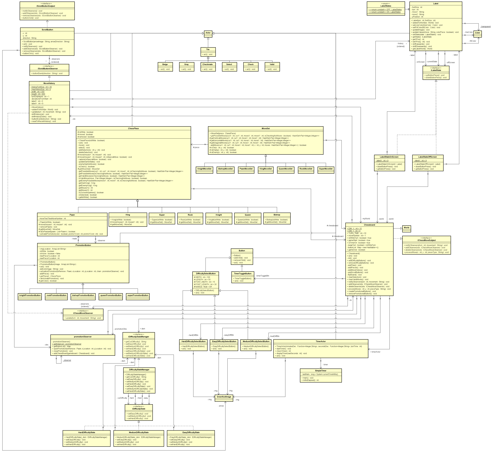

# Team Four Musketeers

## Topic of Project
Chess

## Team Members
- Eric Arreola
- John Lu
- Richard Ngo
- Ryan Tran

## Summary of Contributions
- Eric Arreola:
- John Lu:
- Richard Ngo:
- Ryan Tran:

## Summary of Project and Key Features

We implemented the base game of Chess with added modifications to it. Each player has a move timer that skips their turn. Players are given the option to toggle the timer or change the timer based on difficulty at the start of the game. We also fixed and implemented En Passant, Castling, and Promotion. To add further spice to the promotion feature, we added a super piece that has the moveset of a queen AND a knight (exciting, isn't it? now you can flex on your friends with style). To wrap this all up, we added a move history log that can be scrolled up or down one level at a time with buttons. 

The starter code we used was in Slovakian and had various bugs, so we took one week to refactor it. This starter code in particular looked appealing because of the board swap functionality at the end of each turn. This was a wonderful learning experience for us to learn how to refactor a project into a clean object oriented structure.

## High Level Architecture Diagram

## Who contributed what feature?

## Link to User Story Ad Video

## Link to Demo Video

## Link to Scrum Task Sheet

## UI Wireframes
