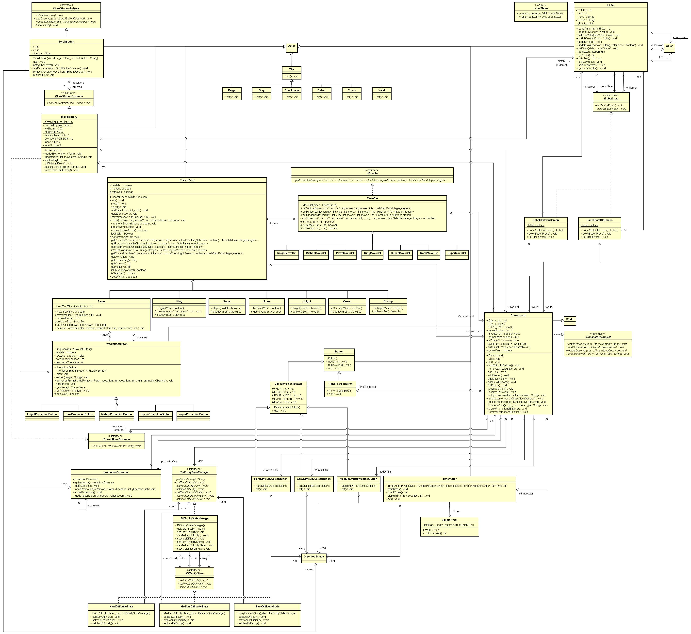
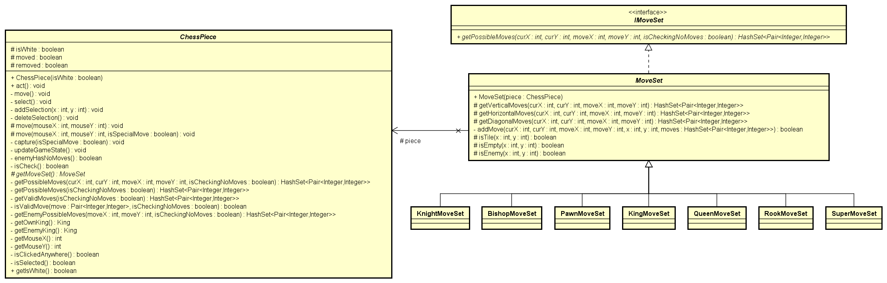

# Team Four Musketeers

## Topic of Project
Chess

## Team Members
- Eric Arreola
- John Lu
- Richard Ngo
- Ryan Tran

## Summary of Contributions
- Eric Arreola
  - Translated some source code to english
  - Refactored inheritance structure of source code to be based less on black and white color pieces and more just on piece types
  - Added move history recording
  - Added scrolling functionality to move history to browse older moves
  - Fixed some issues from translating process like classes inheriting from wrong parent classes
- John Lu
  - Translated chunk of source code to English
  - Refactored code of some chess pieces for readability
  - Fixed coordinates of chessboard after space was made for move history and timer
  - Added timer
  - Added timer toggling
  - Added timer difficulty changing
- Richard Ngo
  - Translated a piece of the source code to English
  - fixed pawn movement errors
  - added promotional buttons to the pawn
- Ryan Tran
  - Translated some source code to English
  - Refactored main game loop and pieces
  - Fixed castling issues
  - Added check, checkmate, and stalemate
  - Added displaying possible moves
  - Added super piece (queen and knight moveset)
  - Added sound effects

## Summary of Project and Key Features

We implemented the base game of Chess with added modifications to it. Each player has a move timer that skips their turn. Players are given the option to toggle the timer or change the timer based on difficulty at the start of the game. We also fixed and implemented En Passant, Castling, and Promotion. To add further spice to the promotion feature, we added a super piece that has the moveset of a queen AND a knight (exciting, isn't it? now you can flex on your friends with style). To wrap this all up, we added a move history log that can be scrolled up or down one level at a time with buttons. 

The starter code we used was in Slovakian and had various bugs, so we took one week to refactor it. This starter code in particular looked appealing because of the board swap functionality at the end of each turn. This was a wonderful learning experience for us to learn how to refactor a project into a clean object oriented structure.

## High Level Architecture Diagram

## Design Discussion
### Observer Pattern: Scrolling Buttons

- The Observer in this case is the MoveHistory class and the Subject is the ScrollingButton class instances (both up and down versions). Whenever one of the buttons is clicked they send a notification to the Observer which would result in the Labels within the MoveHistory object being shifted up or down depending on button type sending the notification.

### Observer Pattern: Chesspiece Movement

- The Observer in this case is the MoveHistory class and the Subject is the Chessboard class which keeps track of chess movements. Whenever a chess piece is moved, the specific movement and type of piece being moved is sent as a string to the Observer which then chooses whatever they want with the string. The MoveHistory class just displays the string within the various Label objects that represent entries within the MoveHistory object.

### State Pattern: Move history label entries visibility

-  This State pattern is to support the scrolling functionality since the Label objects that represent past chesspiece movements need to appear and disappear from the screen depending how far a user scroll since only a limited amount of history is shown on the screen at once. Each Label positioning is incremented by 1 up or down depending on button press. If the position of a Label is detected to be out of bounds in terms of the MoveHistory object size then it is transitioned into the OffScreen state where it is removed from the world but its y position is still tracked. If the y position of a Label returns to being within the bounds of MoveHistory then it goes back to the OnScreen state, which is the default state. 

### Factory Method Pattern: Chess piece possible movements

- The interface IMoveSet acts as the Product participant that defines the interface of objects the factory method creates; it defines the getPossibleMoves method. The abstract MoveSet class implements IMoveSet and defines some shared methods between the concrete MoveSet classes. The concrete MoveSet classes (KingMoveSet, QueenMoveSet, etc.) act as the ConcreteProduct participants that override the getPossibleMoves method. The abstract class ChessPiece acts as the Creator participant that defines the abstract getMoveSet factory method. The concrete ChessPiece classes (King, Queen, etc.) act as the ConcreteCreator participants that override the factory method getMoveSet to return an instance of a ConcreteProduct (KingMoveSet, QueenMoveSet, etc.). The ChessPiece class then calls the getMoveSet method to instantiate the appropriate concrete MoveSet and then calls the getPossibleMoves method on that newly instantiated concrete MoveSet.

## Who contributed what feature?

- Eric Arreola: The primary feature I worked on was the move history functionality along with the ability to scroll through previous recorded move history. In order to get this functionality as a whole working I ended up using three patterns for different aspects of move history. The first aspect of the feature is being able to actually record the chesspiece movement in a way that would be useful for the user of the game. This was done by making move history a class object called MoveHistory that would become an observer of the class Chessboard which would act as a subject that takes in x and y coordinates from chesspieces, the pattern overall was thus Observer. On chesspiece movements, the Chessboard class would notify its observers with a string that represents the new position of the chess piece along with the chess piece type. In order to display these strings each history entry within the MoveHistory object is basically a container of the class type Label since greenfoot requires different displaying objects to each be of actor type which Label is. In order to implement the move history scrolling feature two patterns were used. The Observer pattern was once again used with MoveHistory being an observer but this time the subject would be objects of the ScrollingButton class. Each time one of the buttons would be clicked the ScrollingButton would send a notification to the MoveHistory object which would result in the Labels within the MoveHistory object being shifted up or down depending on button type sending the notification. Since only a limited amount of Label history entries were allowed on the screen at once there had to be some way to toggle the visibility of the Labels that were meant to be on screen or offf. This is where the second pattern, State comes into play. Each Label was able to enter either an OnScreen or OffScreen state with the default being OnScreen. When the position of a label was detected to be OffScreen in terms of the MoveHistory object container size then it would be sent to the OffScreen state and removed from the world, if at some point its position was modified enough to be on screen through the scrolling buttons then its state would be transferred to OnScreen.

- John Lu: The primary feature I worked on was the timer leveraging Decorator and State patterns. The base functionality uses the built-in SimpleTimer class in Greenfoot, which I put into a wrapper class called TimerActor. This built-in timer acts as a stopwatch incrementing in milliseconds. Therefore, I had to use the Decorator pattern to convert the raw seconds (I had a separate function to convert milliseconds to seconds) into a readable display. For the Decorator pattern, I used two separate functions to output the minutes and seconds displays and passed them in as anonymous functions to TimerActor in Chessboard. For timer toggling and difficulty changing, I added buttons for each respective functionality. Timer toggling was controlled by a boolean in Chessboard; likewise, timer difficulty levels were controlled by a value denoting turn time. A gameStart boolean in Chessboard ensured that timer could only be modified at the start of the game. I used the state pattern to control the transparency of the difficulty buttons. This involved the DifficultyStateMachine manager and the IDifficultyState states. Depending on which difficulty was selected for the current state, I would change the transparency of each button in their respective act functions.

- Richard Ngo: The main feature I worked on was the pawn promotion selection. Once the pawn cross the threshold it would trigger the Singleton "PromotionObserver" to send a message out to the promotional buttons. Each of these buttons derived from the parent "factory" class (PromotionButton) into there individual subclasses to display.

- Ryan Tran: The main component that I own is the piece movement, which I used the factory method design pattern to implement. The factory method design pattern defines an interface for creating an object but lets subclasses decide which class to instantiate. I chose this design pattern because I wanted to delegate the responsibility of object instantiation to the subclasses. The interface IMoveSet acts as the Product participant that defines the interface of objects the factory method creates; it defines the getPossibleMoves method. The abstract MoveSet class implements IMoveSet and defines some shared methods between the concrete MoveSet classes. The concrete MoveSet classes (KingMoveSet, QueenMoveSet, etc.) act as the ConcreteProduct participants that override the getPossibleMoves method. The abstract class ChessPiece acts as the Creator participant that defines the abstract getMoveSet factory method. The concrete ChessPiece classes (King, Queen, etc.) act as the ConcreteCreator participants that override the factory method getMoveSet to return an instance of a ConcreteProduct (KingMoveSet, QueenMoveSet, etc.). The ChessPiece class then calls the getMoveSet method to instantiate the appropriate concrete MoveSet and then calls the getPossibleMoves method on that newly instantiated concrete MoveSet.

## Design Notes

## UI Wireframes

## Link to User Story Ad Video
[https://www.youtube.com/watch?v=zv_YKkZTb7g](https://www.youtube.com/watch?v=zv_YKkZTb7g)

## Link to Demo Video
[https://www.youtube.com/watch?v=4hI0DJdz5as](https://www.youtube.com/watch?v=4hI0DJdz5as)

## Link to Scrum Task Sheet
[https://docs.google.com/spreadsheets/d/1vNNHV441aIaOG6byEEKgsRQPKemb-DR_-ST4-R4IHVQ/edit?usp=sharing](https://docs.google.com/spreadsheets/d/1vNNHV441aIaOG6byEEKgsRQPKemb-DR_-ST4-R4IHVQ/edit?usp=sharing)

## Extra Credit Excellence Award Target
Quality Award
